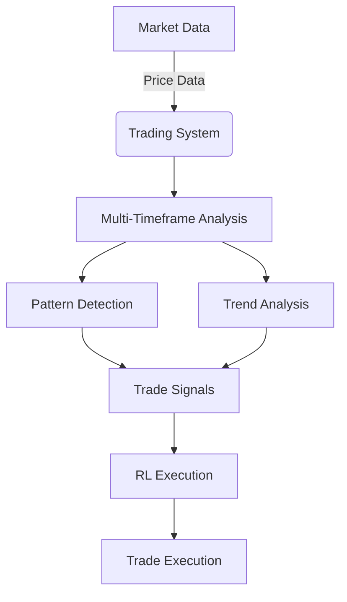

# RL Trader

<!-- Table of Contents -->
## Table of Contents
- [RL Trader](README.md)
  - [Professional-Grade Algorithmic Trading System](README.md)
  - [How the Code Works](README.md)
  - [Why This Code is Professional](README.md)
  - [Features](README.md)
  - [Project Structure and Data Storage](README.md)
  - [Setup](README.md)
  - [System Architecture](README.md)
  - [Installation](README.md)
  - [Usage](README.md)
  - [Configuration](README.md)
  - [Documentation](README.md)
  - [Trading Strategy Documentation](README.md)
  - [Special Time Logic](README.md)
  - [Strategy Structure](README.md)
  - [Implementation Plan](README.md)
  - [New: Quick Start Setup](README.md)
  - [New: Configuration Details](README.md)
  - [New: Running](README.md)
  - [New: Strategy Overview](README.md)
  - [New: Data](README.md)
  - [New: Environment Variables](README.md)
  - [New: Troubleshooting](README.md)

## Professional-Grade Algorithmic Trading System

This project presents a sophisticated algorithmic trading system built on robust technical analysis and advanced reinforcement learning. Designed for precision and adaptability, it offers a professional-grade solution for automated market analysis and trade execution.

The system implements a comprehensive intraday trading strategy based on ICT (Inner Circle Trader) principles, incorporating multi-timeframe analysis, pattern recognition, and intelligent decision-making using both rule-based algorithms and reinforcement learning.

## How the Code Works

The system operates through a meticulously designed pipeline, integrating multi-timeframe analysis, comprehensive pattern detection, and intelligent reinforcement learning for optimal trading decisions:

1.  **Data Acquisition**: The system fetches historical and real-time market data from multiple sources including Alpha Vantage, Alpaca, Polygon, and Finnhub. It also scrapes economic calendar data from Forex Factory. This data is primarily processed in-memory during runtime, but historical data can be optionally persisted to the SQLite database located at `data/database/trading_data.sqlite`.

2.  **Daily Setup Routine**: Each morning, the system performs a comprehensive market analysis to establish the daily bias. This includes:
    *   LLM-based analysis of macro news and economic calendar events
    *   Technical analysis of SPY across multiple timeframes (daily, weekly, 4H, 1H)
    *   Comparison of LLM and technical analysis results to determine the final daily bias

3.  **Multi-Timeframe Analysis**: During the trading session, the system employs a multi-timeframe approach:
    *   1-hour timeframe for trend confirmation
    *   15-minute timeframe for pattern detection and trade entry signals

4.  **Advanced Pattern Detection**: The system detects various technical patterns including:
    *   Liquidity sweeps
    *   Inverse Fair Value Gaps (FVG)
    *   Change in State of Delivery (CSD)
    *   Bullish flag patterns
    *   PDRA (Premium/Discount Repricing Array) alignment

5.  **Reinforcement Learning (RL) Integration**: The system integrates Reinforcement Learning using Proximal Policy Optimization (PPO) agents. These RL models are trained on historical data and saved to the `models/` directory. They learn optimal trading strategies, confirm signals, and fine-tune execution, leading to adaptive and intelligent trading decisions.

6.  **Risk Management**: The system incorporates dynamic risk management, calculating position sizes based on predefined risk-per-trade parameters and pattern-specific stop-loss levels. This ensures capital preservation and controlled exposure to market volatility.

## Why This Code is Professional

This trading system stands out due to several professional attributes:

*   **Modular and Scalable Architecture**: The codebase is structured into distinct modules (data, strategies, agents, utils), promoting maintainability, reusability, and easy expansion of functionalities.
*   **Robust Technical Analysis**: It leverages industry-standard technical indicators and a comprehensive suite of ICT-based patterns, ensuring a deep and accurate understanding of market dynamics.
*   **Intelligent Decision Making with RL**: The integration of reinforcement learning moves beyond static rules, allowing the system to learn, adapt, and optimize its trading behavior based on market feedback, a hallmark of advanced algorithmic trading.
*   **Rigorous Risk Management**: Built-in risk controls are paramount for professional trading. This system's dynamic position sizing and pattern-aware stop losses demonstrate a commitment to capital protection.
*   **Clear Documentation**: Comprehensive documentation ensures clarity, ease of setup, and understanding for users and developers.

## Features

-   **Multi-Timeframe Trading**:
    -   5–15min for entry signals (configurable)
    -   1-hour for trend confirmation
-   **Modular Entry Engine (New)**:
    -   Momentum continuation setup (EMA20 slope, MACD histogram trend, price vs EMA20/VWAP)
    -   Mean reversion to VWAP/Bands setup (Bollinger extremes with reversion)
    -   Soft daily bias weighting (UNCERTAIN reduces size instead of blocking)
-   **Advanced Pattern Detection**:
    -   Liquidity Sweeps
    -   Inverse Fair Value Gaps (FVG)
    -   Change in State of Delivery (CSD)
    -   Bullish Flag Patterns
    -   PDRA Alignment
-   **Reinforcement Learning**: PPO agents for trade execution
-   **Risk Management**:
    - Position sizing based on fixed risk-per-trade and per-share risk
    - ATR-based stops/targets with default 1.0 ATR stop and ~1.8 ATR target
    - Breakeven move after +1R
    - Daily max loss halt applied per-day in backtests
- **Multiple Data Sources**: Support for Alpha Vantage, Alpaca, Polygon, and Finnhub
- **Provider Fallbacks (New)**: If the selected provider fails (e.g., invalid API key), the system automatically falls back to alternative providers (Alpaca, then Finnhub) to keep workflows running
-   **Economic Calendar Integration**: Scrapes data from Forex Factory for comprehensive market analysis

## Project Structure and Data Storage

This section details the purpose of key files and directories within the project and where different types of data are stored.

### Files

*   `.env`: Contains environment variables with API keys and other sensitive information.
*   `.gitignore`: Specifies files and directories that Git should ignore, preventing them from being committed to the repository.
*   `Dockerfile`: Defines the Docker image for containerizing the application, ensuring a consistent and isolated execution environment.
*   `LICENSE`: Contains the licensing information for the project, typically MIT License.
*   `README.md`: This file, providing a comprehensive overview of the project, its functionality, setup, and structure.
*   `requirements.txt`: Lists all Python package dependencies required for the project. These are installed using `pip install -r requirements.txt`.
*   `run.py`: The main entry point for the application. It orchestrates the execution of different modes (setup, trading, backtesting) based on command-line arguments.
*   `scraper.py`: Implements the Forex Factory calendar and news scraper.
*   `test_db.sqlite`: A SQLite database file specifically used for testing purposes.

### Directories

*   `.git/`: (Hidden) Contains all the necessary objects and metadata that Git uses for version control.
*   `.pytest_cache/`: Stores cached information generated by `pytest`, the testing framework, to speed up subsequent test runs.
*   `config/`: Holds configuration files for the application.
    *   `config.yaml`: The primary configuration file for general application settings, such as risk management parameters, timeframes, and other customizable options.
    *   `secrets.yaml`: Contains sensitive information like API keys. This file is typically excluded from version control via `.gitignore`.
*   `data/`: This directory is intended for storing persistent data.
    *   `database/`: Contains the main operational SQLite database file (`trading_data.sqlite3`) where historical market data, trade logs, and other persistent application data are stored.
*   `Doc/`: Contains project documentation.
*   `models/`: Stores trained Reinforcement Learning (RL) models (typically as `*.zip` files). This directory also contains `models/logs` for training logs. These models are serialized after training and loaded from this directory for inference during trading sessions.
*   `src/`: Contains the core source code of the application. This is where the main logic for data acquisition, strategy implementation, RL agents, and utility functions resides.
    *   `agents/`: Contains reinforcement learning agents and trading agents.
        *   `rl_agent.py`: Implements the reinforcement learning agent using PPO.
        *   `trading_agent.py`: Implements the trading agent that coordinates various components.
    *   `data/`: Contains data fetching implementations for different providers.
        *   `alpaca_data.py`: Fetches data from Alpaca.
        *   `alpha_vantage.py`: Fetches data from Alpha Vantage.
        *   `finnhub_data.py`: Fetches data from Finnhub.
        *   `polygon_data.py`: Fetches data from Polygon.
        *   `database.py`: Manages the SQLite database.
    *   `execution/`: Contains trade execution logic and historical backtesting.
        *   `alpaca_executor.py`: Executes trades through the Alpaca API.
        *   `backtester.py`: Historical backtest engine used when --start/--end are provided. Loads data, filters RTH, iterates day-by-day, manages positions, and records trades.
    *   `strategies/`: Contains trading strategy implementations.
        *   `intraday_strategy.py`: Implements the core intraday trading strategy based on ICT principles.
        *   `multi_timeframe.py`: Implements multi-timeframe analysis.
        *   `pattern_detection.py`: Implements pattern detection algorithms.
        *   `trend_analysis.py`: Implements trend analysis algorithms.
    *   `utils/`: Contains utility functions and helper classes.
        *   `data_fetcher.py`: Provides a unified interface for fetching data from various sources.
        *   `llm_analyzer.py`: Handles analysis using large language models.
        *   `logger.py`: Implements logging functionality.
        *   `pattern_visualization.py`: Provides tools for visualizing patterns.
        *   `risk_management.py`: Implements risk management algorithms.
*   `ta-lib/`: Contains files related to TA-Lib, a technical analysis library.

## Setup

1.  Install dependencies:
```bash
pip install -r requirements.txt
```
2.  Set environment variables:
```bash
cp .env.example .env
# Edit .env with your API keys
# Example keys (do not use test or S3 flatfiles for Polygon):
ALPACA_API_KEY=your_key
ALPACA_SECRET_KEY=your_secret
POLYGON_API_KEY=your_polygon_rest_api_key  # REST market data key, not S3 flatfiles
FINNHUB_API_KEY=your_finnhub_key
```
3.  Run the system:
```bash
python run.py
```

## System Architecture


## Installation
### Prerequisites
*   Python 3.10+
*   Chrome browser (for scraping functionality)
*   API Keys: Required for fetching market data. You'll need keys for Alpha Vantage, Alpaca, Polygon, and/or Finnhub depending on which data sources you plan to use.
  - Polygon: Use the REST API key from the Polygon dashboard (not the S3 flatfiles Access Key). If a Polygon REST key is missing or invalid, the app will automatically fall back to Alpaca and then Finnhub when fetching data.
*   Ollama (for local LLMs) - Optional

### Steps
1.  Clone the repository:
    ```bash
    git clone https://github.com/yourusername/rl-trader.git
    cd rl-trader
    ```
2.  Set up virtual environment:
    ```bash
    python -m venv venv
    source venv/bin/activate  # Linux/MacOS
    venv\Scripts\activate    # Windows
    ```
3.  Install dependencies:
    ```bash
    pip install -r requirements.txt
    ```
4.  Install Ollama models (Optional):
    If you are using Ollama for local LLMs, pull the necessary models:
    ```bash
    ollama pull gemma:3b
    ollama pull deepseek-r1:8b
    ```
5.  Configure environment:
    ```bash
    cp .env.example .env
    ```
6.  Edit configuration files:
    *   `.env`: Add your API keys and any other sensitive information.

## Usage

*   **Daily Pre-Market Setup** (8:00 AM EST)
    ```bash
    python run.py --setup
    ```
    Performs daily market analysis and sets the daily bias.

*   **Trading Session** (9:30 AM - 3:45 PM EST)
    ```bash
    python run.py --trade
    ```
    Runs real-time trading loop.
    Executes trades based on multi-timeframe analysis.
    Manages risk and position sizing.

*   **Backtesting (historical, date-ranged)**
```bash
# Example: full-year 2023 SPY on 5-minute bars, RTH only, write master trades CSV
python run.py --symbol SPY --timeframe 5min --start 20230101 --end 20231231 --rth-only --csv-out data/trades_master.csv
```
What this does:
- Uses the new historical backtester wired via [python.backtest_main()](run.py:135) and [python.Backtester](src/execution/backtester.py:1)
- Iterates day-by-day across the specified date range
- Applies an RTH filter (09:30–16:00 America/New_York) if --rth-only is set
- Evaluates modular entries each bar using [python.IntradayStrategy.evaluate_entry()](src/strategies/intraday_strategy.py:520)
- Enforces per-day daily max loss halt and continues to the next day
- Saves trades to a master CSV if --csv-out provided and prints a summary at the end

*   **Training an RL Agent**
```bash
# Example: train a PPO agent on SPY 5-minute bars for 2023
python train_rl_agent.py --agent ppo --symbol SPY --timeframe 5min --start 20230101 --end 20231231 --timesteps 10000

# Train a TQC agent with walk-forward training
python train_rl_agent.py --agent tqc --symbol SPY --timeframe 5min --start 20230101 --end 20231231 --timesteps 10000 --walk-forward --train-days 180 --val-days 60 --step-days 60 --wandb-project rl-trader
```

*   **Evaluating an RL Agent**
The `evaluation_enhanced.ipynb` notebook provides a comprehensive framework for evaluating and comparing the performance of different agents. To use it:
1.  Make sure you have the trade logs for the baseline and the RL agents you want to evaluate. The walk-forward training script will generate a trade log for the validation periods.
2.  Open the notebook and update the file paths in the "Configuration and Data Loading" section.
3.  Run the notebook to generate a detailed report with metrics, plots, and a comparison table.
```bash
# Example: evaluate a trained PPO agent
python train_rl_agent.py --agent ppo --symbol SPY --timeframe 5min --start 20240101 --end 20240131 --timesteps 0 --eval-only
```

CLI flags (new):
- --start YYYYMMDD, --end YYYYMMDD: historical date range (required together for backtest mode)
- --symbol SYMBOL: symbol (default from config target_symbol)
- --timeframe: bar size, e.g. 1min, 5min, 15min, 1h, 1day
- --rth-only: filter to Regular Trading Hours (09:30–16:00)
- --capital: override starting capital
- --daily-max-loss-pct: override daily stop percent, e.g. 0.015
- --risk-per-trade-pct: override per-trade risk percent, e.g. 0.005
- --csv-out: path to append per-trade rows, e.g. data/trades_master.csv

## Configuration

Edit `config/config.yaml` to customize:
```yaml
# Risk management
capital: 100000
risk_per_trade: 0.01  # Risk 1% per trade

# Timeframes
timeframes:
  short_term:
    - '15min'
  trend: '1h'
```

## Documentation

See `docs/` for detailed documentation.

### API Documentation

This document provides a comprehensive overview of the key modules and classes within the RL Trader system, detailing their functionalities and how they contribute to the overall trading strategy.

#### Data Collection

##### `DataFetcher`
This class is responsible for fetching various types of market data from multiple sources. It serves as the primary data source for the trading system, ensuring access to accurate and up-to-date historical and real-time financial information.

```python
class DataFetcher:
    def fetch_alpha_vantage_news(symbols=None, topics=None, time_from=None, time_to=None)
    def fetch_fred_data(series_id)
```

##### `TradingSystem`
The main trading system class that orchestrates all components of the trading system.

```python
class TradingSystem:
    def __init__(self, config, llm_analyzer, data_source='alpaca')
    def run_daily_setup(self, macro_news, news_calendar)
    def trading_loop(self)
    def run_backtest(self, symbol, start_date, end_date)
```

#### Trading Strategies

##### `IntradayStrategy`
The `IntradayStrategy` class implements the core trading strategy based on ICT principles. It encompasses methods for detecting various technical patterns and evaluating market bias.

```python
class IntradayStrategy:
    def evaluate_daily_bias_tjr_style(self, spy_daily_data, spy_weekly_data, spy_4h_data, spy_1h_data)
    def detect_bullish_flag(self, data)
    def detect_liquidity_sweep(self, data)
    def detect_inverse_fvg(self, data)
    def detect_smt_divergence(self, spy_data, es_data)
    def detect_csd(self, data, bias)
    def align_pdra(self, data, bias)
```

**Patterns Detected:**
*   Liquidity Sweeps
*   Inverse Fair Value Gaps (FVG)
*   Change in State of Delivery (CSD)
*   Bullish Flag Patterns
*   PDRA Alignment

**Detailed Pattern Descriptions:**

1.  **Liquidity Sweeps**: A liquidity sweep typically involves price briefly moving beyond a significant high/low (where stop-losses or pending orders might be clustered) and then reversing. The implementation checks if the current candle swept the low of the previous candle and closed higher (bullish) or if it swept the high of the previous candle and closed lower (bearish).

2.  **Inverse Fair Value Gaps (FVG)**: An Inverse FVG occurs when price moves through a previously established FVG, and that FVG then acts as support/resistance. The current implementation is a simplified placeholder that looks for a gap between candles and checks if price moves into that gap.

3.  **Change in State of Delivery (CSD)**: CSD is a specific price action pattern indicating a shift in market control. For a bullish CSD, a candle closes above a series of down-closed candles after sweeping a low. For a bearish CSD, a candle closes below a series of up-closed candles after sweeping a high.

4.  **Bullish Flag Patterns**: A bullish flag is a continuation pattern consisting of a strong upward move (the flagpole) followed by a period of consolidation with a slight downward slope (the flag). The implementation looks for a large upward move followed by a few smaller candles indicating consolidation.

5.  **PDRA Alignment**: PDRA (Premium/Discount Repricing Array) involves identifying specific price levels that act as support/resistance. Alignment means price is in a discount zone for bullish bias or premium zone for bearish bias. The implementation checks if the price is near a recent low (for bullish bias) or near a recent high (for bearish bias).

#### Agents

##### `LLMAnalyzer`
The `LLMAnalyzer` class handles analysis using large language models to determine market bias and generate summaries.

```python
class LLMAnalyzer:
    def get_spy_bias(self, macro_news, news_calendar) -> str
    def summarize_text(self, text, max_length=200) -> Dict[str, str]
```

#### Scraper

##### `ForexCalendarScraper`
The `ForexCalendarScraper` class is responsible for scraping economic calendar and news data from Forex Factory. It uses Selenium with undetected_chromedriver to bypass anti-bot measures and extract relevant information for market analysis.

```python
class ForexCalendarScraper:
    def get_news(self, target_month: Optional[str] = None) -> Tuple[List[Dict[str, str]], Dict[str, List[Dict[str, str]]]]
```

**Key Features:**
*   Scrapes economic calendar events with details like date, time, currency, impact, event name, and actual/forecast/previous values
*   Scrapes news articles from various sections including latest stories, fundamental analysis, and breaking news
*   Implements human-like browsing behavior to avoid detection
*   Supports login functionality for accessing premium content
*   Handles retries and error recovery for robust scraping
*   Saves scraped data to JSON files for further processing

**Scraped Data Types:**
1.  **Economic Calendar Events**: Contains information about upcoming economic events that may impact the markets
2.  **News Articles**: Includes headlines, summaries, and other relevant information from various news sections

# Setup Guide

This guide provides detailed instructions for setting up and running the RL Trader system. Following these steps will ensure a smooth installation and proper configuration of all necessary components.

## Requirements

Before proceeding with the installation, ensure you have the following prerequisites:

*   **Python 3.10+**: The system is developed and tested with Python version 3.10 and above.
*   **Chrome Browser**: Required for the scraping functionality.
*   **API Keys**: Required for fetching market data. You'll need keys for Alpha Vantage, Alpaca, Polygon, and/or Finnhub depending on which data sources you plan to use.
*   **Ollama (for local LLMs)**: If you plan to extend the system with local Large Language Models (LLMs) for advanced sentiment analysis or other AI-driven features, you will need [Ollama](https://ollama.ai/) running locally.

## Installation

Follow these steps to get the project up and running on your local machine:

1.  **Clone the Repository**:
    ```bash
    git clone https://github.com/yourusername/rl-trader.git
    cd rl-trader
    ```

2.  **Set Up a Virtual Environment**:
    It is highly recommended to use a virtual environment to manage project dependencies and avoid conflicts with other Python projects.
    ```bash
    python -m venv venv
    source venv/bin/activate  # On Linux/macOS
    venv\Scripts\activate    # On Windows
    ```

3.  **Install Dependencies**:
    Install all required Python packages using pip:
    ```bash
    pip install -r requirements.txt
    ```

4.  **Install Ollama models (Optional)**:
    If you are using Ollama for local LLMs, pull the necessary models:
    ```bash
    ollama pull gemma:3b
    ollama pull deepseek-r1:8b
    ```
5.  **Start Ollama Server (Required for LLM functionality)**:
    The system uses local LLMs via Ollama. Before running the `run.py` script, ensure your Ollama server is running. You can typically start it by:
    ```bash
    ollama serve
    ```
    or by launching the Ollama application. The `config/config.yaml` has been updated to point to `http://localhost:11434/api/generate` for LLM API calls.

6.  **Configure environment**:
    ```bash
    cp .env.example .env
    ```

## Configuration

Configure the system by setting up your API keys and other parameters:

1.  **Edit Configuration Files**:
    *   `.env`: Add your API keys and any other sensitive information.

## Running the System

### New: Historical Backtester quick start
To run a historical backtest with increased trade opportunities and realistic risk handling:
```bash
python run.py --symbol SPY --timeframe 5min --start 20230101 --end 20231231 --rth-only --csv-out data/trades_master.csv
```
Tips:
- If your configured provider fails (e.g., Polygon “Unknown API Key”), the runner automatically falls back to Alpaca, then Finnhub, so the backtest can proceed with available data.
- If your data provider ignores start/end, the backtester will still filter the loaded data locally by date range.
- If you see very few trades, check provider data coverage and timeframe, and confirm RTH filtering aligns with your instrument’s session.
- Daily halts occur per day when cumulative P&L hits the configured daily_max_loss. The engine resumes on the next trading day.

Once installed and configured, you can run the system using the `run.py` script with various arguments:

*   **Daily Pre-Market Setup** (e.g., 8:00 AM EST):
    ```bash
    python run.py --setup
    ```
    This command performs the daily market analysis and sets the daily bias.

*   **Trading Session** (e.g., 9:30 AM - 3:45 PM EST):
    ```bash
    python run.py --trade
    ```
    This initiates the real-time trading loop, where the system executes trades based on multi-timeframe analysis, manages risk, and dynamically sizes positions.

*   **Backtesting (date-ranged)**:
```bash
python run.py --symbol SPY --timeframe 5min --start 20230101 --end 20231231 --rth-only --csv-out data/trades_master.csv
```
This uses the new historical backtester. It will:
- compute a soft-weighted daily bias via [python.IntradayStrategy.evaluate_daily_bias_tjr_style()](src/strategies/intraday_strategy.py:66)
- evaluate entries each bar via [python.IntradayStrategy.evaluate_entry()](src/strategies/intraday_strategy.py:520)
- manage positions with ATR stops/targets and breakeven
- enforce per-day daily loss limits and continue to the next day
- append per-trade rows to data/trades_master.csv if provided

## Customizing Configuration

Edit `config/config.yaml` to customize various parameters of the trading system:

```yaml
# Risk management
capital: 100000
risk_per_trade: 0.01  # Risk 1% per trade

# Timeframes
timeframes:
  short_term:
    - '15min'
  trend: '1h'
```

For more detailed information on the system's architecture, API, and trading strategy, refer to the `docs/` directory.

## Reinforcement Learning Framework

This project includes a reinforcement learning framework for optimizing the trading strategy. The framework is built on top of OpenAI Gym and Stable Baselines3.

### Training an Agent

To train an RL agent, use the `train_rl_agent.py` script. This script allows you to train a PPO or SAC agent on a given stock, timeframe, and date range.

```bash
# Example: train a PPO agent on SPY 5-minute bars for 2023
python train_rl_agent.py --agent ppo --symbol SPY --timeframe 5min --start 20230101 --end 20231231 --timesteps 10000
```

The trained model will be saved to the `models/` directory.

### Evaluating an Agent

You can compute summary trading metrics (including win/loss percentages and average win) from a trades CSV via the evaluation script:

```bash
python scripts/evaluate.py --symbol SPY --timeframe 5min --start 20230101 --end 20230331 --rth-only --csv-out data/trades_master.csv
```

Example JSON output fields include:
```json
{
  "win_pct": 53.8971807628524,
  "loss_pct": 46.1028192371476,
  "avg_win": 245.76226153846184
}
```

To evaluate a trained RL agent, you can also use the `evaluation.ipynb` notebook. This notebook provides a comprehensive analysis of the agent's performance, including:

*   Performance metrics (PnL, Sharpe ratio, etc.)
*   Trade analysis (R-multiple distribution, etc.)
*   Risk analysis (tail events, etc.)
*   Visualizations (equity curve, etc.)

To use the notebook, you will need to update the file paths to the backtest results for the baseline strategy and the trained RL agents.

# Trading Strategy Documentation

This document outlines the core trading strategy implemented in the RL Trader system, emphasizing its multi-timeframe approach, pattern recognition capabilities, and risk management principles. The strategy is designed for robustness and adaptability in dynamic market conditions.

## Multi-Timeframe Analysis

The strategy employs a multi-timeframe analysis to gain a comprehensive understanding of market dynamics, distinguishing between overarching trends and short-term trading opportunities.

1.  **Trend Framework (1-Hour Timeframe)**:
    *   **EMA Analysis**: Exponential Moving Averages are used to identify the primary trend direction.
    *   **Yesterday's Candle Analysis**: The shape of yesterday's candle is analyzed for clues about market sentiment.

2.  **Signal Framework (15-Minute Timeframe)**:
    *   **Liquidity Sweeps**: Identification of price movements that briefly move beyond significant highs/lows.
    *   **Inverse Fair Value Gaps (FVG)**: Detection of price imbalances that act as support/resistance.
    *   **Change in State of Delivery (CSD)**: Identification of shifts in market control.
    *   **PDRA Alignment**: Determining if price is in a discount zone for bullish bias or premium zone for bearish bias.

## Pattern Recognition

The system incorporates a sophisticated pattern recognition module capable of detecting a wide array of technical patterns based on ICT principles:

### Patterns Detected:
*   Liquidity Sweeps
*   Inverse Fair Value Gaps (FVG)
*   Change in State of Delivery (CSD)
*   Bullish Flag Patterns
*   PDRA Alignment

## Pattern Priority and Signal Generation

Signals are generated based on a hierarchical priority, ensuring that the most impactful patterns aligned with the overall trend are prioritized:

1.  **Liquidity Sweep Confirmation**: A liquidity sweep must be detected as the first step.
2.  **Pattern Confirmation**: Additional patterns (FVG, CSD) must be detected to confirm the signal.
3.  **PDRA Alignment**: The price must be in an appropriate zone based on the daily bias.

## Risk Management

Robust risk management is integral to the strategy, focusing on capital preservation and controlled exposure:

*   **1% Risk Per Trade**: A strict rule of risking no more than 1% of the total capital per trade is enforced to limit potential losses.
*   **Pattern-Specific Stop Losses**: Stop-loss levels are dynamically calculated based on the characteristics of the detected pattern and market volatility.
*   **Dynamic Position Sizing**: Position size is calculated based on the risk per trade and the distance to the stop loss, ensuring that the dollar risk remains constant regardless of the trade's entry and stop-loss points.

## Reinforcement Learning Integration

Reinforcement Learning (RL) plays a crucial role in refining and optimizing the trading strategy. PPO (Proximal Policy Optimization) models are trained on historical market data to:

*   **Signal Confirmation**: RL agents provide an additional layer of validation for generated trading signals, reducing false positives.
*   **Execution Optimization**: The agents learn optimal trade execution timings and strategies, adapting to subtle market nuances that rule-based systems might miss.
*   **Adaptive Learning**: The RL component allows the system to continuously learn and adapt to changing market conditions, improving its performance over time without explicit reprogramming.

## Daily Setup Routine (Pre-Market)

*   **Time**: Run as part of the daily setup routine.
*   **LLM Analysis (Gemma + DeepSeek)**:
    *   **Query**: Ask both models: "What is SPY likely to do today (bullish or bearish)? Consider yesterday's price action, today's economic calendar (FOMC, CPI, etc.), earnings, and global news."
    *   **Inputs**:
        *   All macro news from the previous 24 hours.
        *   Today's news calendar (FOMC, PPI, CPI, etc.).
        *   Chart data: daily, weekly, 4h, and 1h.
    *   **Decision**: Compare LLM responses. If both agree → mark daily bias. If they differ → mark uncertain, default to neutral or wait for NY open price action confirmation.

## Daily Bias Evaluation (TJR Style)

*   **Yesterday's Candle Shape**: Analyze the shape of yesterday's candle (engulfing, top wick, etc.) for clues about market sentiment.
*   **Higher Time Frame Trend Structure**: Identify the bullish or bearish trend structure on higher timeframes.
*   **EMA Trend**: Compare the last closing price to the 20-period EMA to determine trend direction.

## Intraday Execution Plan (Live Trading)

*   **Timeframes**:
    *   **Trend Framing**: 1H.
    *   **Entry Setups**: 15M.

*   **Execution Model (TJR Style)**:
    *   **Liquidity Sweep**: Wait for a sweep of a key low or high (liquidity sweep).
    *   **Confirmation**: Look for:
        *   **Inverse Fair Value Gap (FVG)**.
        *   **Change in State of Delivery (CSD)**:
            *   **Bullish**: Candle closes above a series of down-closed candles after sweeping a low.
            *   **Bearish**: Candle closes below a series of up-closed candles after sweeping a high.
    *   **Align PDRA (Premium/Discount Repricing Array)**:
        *   If bullish → PDRA below price (discount zone).
        *   If bearish → PDRA above price (premium zone).
    *   **Entry**: Execute trade when all conditions are met.
    *   **Stop Loss**: Below/above structure.
    *   **Target**: Next internal/external liquidity level.

## Special Time Logic

*   **10:00 AM EST**: Watch the 4H candle open.
    *   **Bullish bias**: Expect manipulation lower → distribution higher.
    *   **Bearish bias**: Expect manipulation higher → distribution lower.
*   **9:40 AM**: Identify draw on liquidity. Look at PDRA reactions to confirm bullish/bearish continuation. Setup for trade entry around 9:45 AM on low timeframes.

## Strategy Structure

*   **Long-only or short-only** per daily bias.
*   If bias is invalidated (structure break in opposite direction), system exits trade early or flips if signal confirms.

## Implementation Plan

*   **Pre-market script**: Use LLMs to analyze macro news and set daily bias.
*   **Chart data reader**: Pull multi-timeframe SPY data.
*   **Real-time monitor**: Detect liquidity sweeps, FVGs, and CSD live using 15M data.
*   **Trade executor**: Integrate with broker API (like Alpaca) for live order placement. Attach stop loss and target based on internal/external liquidity.
*   **Logger + dashboard**: Save reasons for entry, timeframes, model answers, price levels.

This comprehensive strategy, combining multi-timeframe analysis, advanced pattern recognition based on ICT principles, and intelligent reinforcement learning, positions the RL Trader system as a professional-grade solution for algorithmic trading.

---

# New: Quick Start Setup

Recommended: Python 3.10+

1) Create and activate a virtual environment (Windows CMD):
```
python -m venv .venv
.\.venv\Scripts\activate
```

2) Install dependencies:
```
pip install -r requirements.txt
```

3) TA-Lib on Windows (required by talib)
- Prefer prebuilt wheels or conda packages for TA-Lib binary.
- A local TA-Lib source tree exists under [ta-lib/](ta-lib/), but typical users should install the TA-Lib binary first so the Python package (ta-lib) can load its native libs.
- See official install docs: https://ta-lib.org/ (use appropriate Windows instructions or prebuilt wheels).
- If using conda: `conda install -c conda-forge ta-lib`

4) Configure credentials and runtime settings (see sections below).

5) Run:
```
python run.py
```

# New: Configuration Details

Provider selection and fallbacks:
- Primary provider is chosen by config or environment. If the chosen provider fails (e.g., Polygon “Unknown API Key”), DataFetcher automatically falls back to Alpaca, then Finnhub.
- Start/end handling is normalized. Even if a provider doesn’t accept start/end, the backtester slices the loaded data locally to the requested date range.

Known provider nuances:
- Polygon: Requires a valid REST API key; S3 flatfiles credentials will not work for the REST client.
- Alpaca: Intraday endpoints require ISO datetime; this project normalizes string dates (YYYYMMDD) for you.
- Finnhub: Accepts start/end and converts them to epoch internally in this project.

- Runtime settings: [config/config.yaml](config/config.yaml)
  - Adjust risk parameters, timeframes, data providers, and feature toggles.
- Secrets/credentials: [config/secrets.yaml](config/secrets.yaml)
  - Store API keys (e.g., Alpha Vantage, Alpaca, Polygon, Finnhub). Do not commit real secrets.
- Optional environment file: [.env](.env)
  - If you prefer environment variables, define API keys here (or in your shell). The code may read environment variables even when using YAML-based secrets.

Examples:
- Update general behavior in [config/config.yaml](config/config.yaml).
- Put API keys in [config/secrets.yaml](config/secrets.yaml) or set environment variables before running.

# New: Running

Default run:
```
python run.py
```

If command-line arguments are supported, they can be passed as needed. If unknown, use the defaults above and adjust behavior in [config/config.yaml](config/config.yaml).

Data ingestion (scraper):
```
python scraper.py
```
Use [scraper.py](scraper.py) to fetch/scrape economic calendar/news as needed.

Strategy selection:
- If strategy/mode flags exist, pass them to [run.py](run.py). Otherwise, configure defaults in [config/config.yaml](config/config.yaml) and add or modify strategies under [src/strategies/](src/strategies/).

# New: Strategy Overview

- Example strategy implementation: [src/strategies/intraday_strategy.py](src/strategies/intraday_strategy.py)
  - Purpose: intraday trading based on ICT principles with multi-timeframe analysis and pattern detection.
- Add new strategies in: [src/strategies/](src/strategies/)
  - Create a new Python file and integrate it via configuration and/or the main runner [run.py](run.py).
- Methodology reference: [docs/trading_plan.md](docs/trading_plan.md)

# New: Data

- Project data folder: [data/](data/)
  - Databases/live or historical artifacts may be stored under [data/database/](data/database/).
- Models produced by RL training: [models/](models/)
- If you introduce new datasets, keep them under [data/](data/) with clear subfolders.

# New: Environment Variables

Provider keys and notes:
- ALPACA_API_KEY, ALPACA_SECRET_KEY
- POLYGON_API_KEY  (REST market data key only; do not use S3 flatfiles Access/Secret)
- FINNHUB_API_KEY
- Optional: Configure fallback preferences in [python.DataFetcher.fetch_data()](src/utils/data_fetcher.py:98) via config data_source and environment variables.

Common variables you might need to set (names are examples; do not include real secrets):
- ALPACA_API_KEY, ALPACA_API_SECRET
- ALPHA_VANTAGE_API_KEY
- POLYGON_API_KEY
- FINNHUB_API_KEY

Set in your shell or in [.env](.env). If also using [config/secrets.yaml](config/secrets.yaml), ensure values are consistent.

# Path to Production

Obtaining a production-ready trading agent is an iterative process that involves more than just a single training run. This framework provides the tools to perform this process. Here are the recommended steps to get from this codebase to a production-ready agent:

1.  **Run the Production-Level Training**: The `run_production.sh` script is the starting point for training a robust agent on a large dataset. This will give you a well-trained model to begin with.

2.  **Hyperparameter Optimization**: For optimal performance, you should perform a systematic search for the best hyperparameters for the TQC agent and the `AsymmetricReward` function. You can use a library like Optuna or Hyperopt, integrated with the `train_rl_agent.py` script, to automate this process. The `wandb` integration will help you to track and compare the results of different hyperparameter configurations.

3.  **Cross-Validation**: To ensure the agent is not overfitted to a specific instrument or timeframe, you should perform cross-validation by running the training and evaluation on:
    *   **Different Instruments**: Other ETFs (e.g., QQQ, IWM) or large-cap stocks.
    *   **Different Timeframes**: e.g., 15-minute, 1-hour.

4.  **Rigorous Backtesting and Risk Analysis**: Use the `evaluation_enhanced.ipynb` notebook to perform a deep analysis of the agent's performance. Pay close attention to:
    *   The asymmetric payoff profile (the >=80% small losses, <=20% large wins objective).
    *   Risk-adjusted returns (Sharpe, Sortino, Calmar).
    *   Drawdown characteristics.
    *   Performance in different market regimes.

5.  **Forward Testing (Paper Trading)**: Once you have an agent that performs well in backtesting, the final and most crucial step is to deploy it in a paper trading environment (e.g., with Alpaca). This will allow you to see how the agent performs with live market data, latency, and other real-world frictions.

By following this iterative process of training, evaluation, and refinement, you can use this framework to develop a robust and profitable production-ready trading agent.

# Advanced Features

This framework includes several advanced features for research and development.

## Hierarchical Reinforcement Learning (HRL)

The HRL framework allows for training a two-level agent with a Manager and a Worker.

-   **Manager**: Decides on the high-level strategy (e.g., long, short, neutral) and the target R-multiple.
-   **Worker**: Executes the strategy defined by the Manager.

To train an HRL agent, you can use the `train_hrl_agent.py` script.

## Multi-Agent Reinforcement Learning (MARL)

The MARL framework simulates a market with multiple interacting agents.

-   **Multi-Agent Environment**: The `MultiAgentTradingEnv` uses the PettingZoo API to manage multiple agents.
-   **Independent Learners**: Each agent is an independent TQC agent that learns its own policy.

To train a MARL system, you can use the `train_marl_agent.py` script.

## Offline Reinforcement Learning

The Offline RL framework allows for training an agent on a fixed dataset of historical trades.

-   **Offline RL Library**: The framework uses the `d3rlpy` library with the CQL algorithm.
-   **Offline Dataset**: You can prepare an offline dataset from a trade log using the `prepare_offline_dataset.py` script.
-   **Offline Training**: You can train an offline agent using the `train_offline_agent.py` script.

## Explainable AI (XAI)

The `evaluation_enhanced.ipynb` notebook includes a section for XAI analysis using the `shap` library. This allows you to understand the decisions of the trained agents.

## Advanced Architectures (Transformer Policy)

The framework supports a Transformer-based policy for the TQC agent.

-   **Transformer Policy**: The `TransformerPolicy` uses a Transformer encoder to process the sequence of market data.
-   **Usage**: You can use the `--policy transformer` argument in the `train_rl_agent.py` script to use the Transformer policy.

# New: Troubleshooting

TA-Lib on Windows
- Error: “talib/_ta_lib.c:…” or missing ta_lib.dll
  - Install TA-Lib binary first (conda-forge ta-lib or prebuilt wheel matching your Python/arch).
  - Confirm the ta-lib DLL is discoverable on PATH or installed via conda.
  - Reinstall the Python package: `pip install --force-reinstall ta-lib`

Virtual environment and pip issues
- If installs fail or resolve to wrong interpreter:
  - Ensure venv is active: `.\.venv\Scripts\activate`
  - Clear build cache and retry: `pip cache purge` then `pip install -r requirements.txt`
  - Pin versions as needed in [requirements.txt](requirements.txt)

Runtime/config issues
- If the app can’t find API keys:
  - Verify [.env](.env) or [config/secrets.yaml](config/secrets.yaml) contains the keys.
  - Confirm your terminal session has the environment variables exported before running.
- If behavior doesn’t match expectations:
  - Adjust [config/config.yaml](config/config.yaml) and rerun.
  - Check logs/output for hints (see any logging setup under src/utils if present).

```