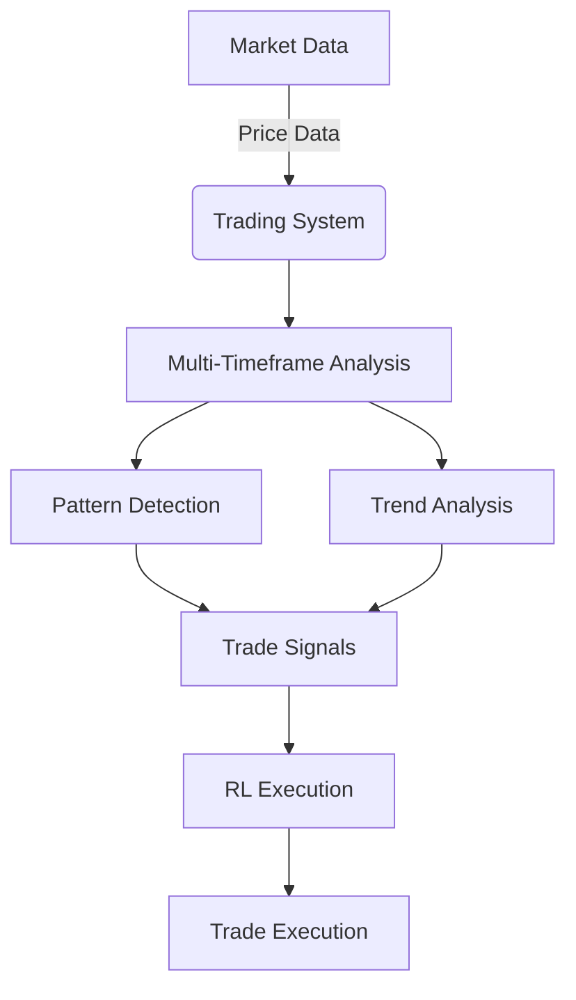

# RL Trader

## Professional-Grade Algorithmic Trading System

This project presents a sophisticated algorithmic trading system built on robust technical analysis and advanced reinforcement learning. Designed for precision and adaptability, it offers a professional-grade solution for automated market analysis and trade execution.

## How the Code Works

The system operates through a meticulously designed pipeline, integrating multi-timeframe analysis, comprehensive pattern detection, and intelligent reinforcement learning for optimal trading decisions:

1.  **Data Acquisition**: The system fetches historical and real-time market data, including news. It prioritizes Alpha Vantage, with Alpaca as a fallback for robust data and news availability. This data is primarily processed in-memory during runtime, but historical data can be optionally persisted to the SQLite database located at `data/database/trading_data.sqlite` (or `test_db.sqlite` for testing).

2.  **Multi-Timeframe Analysis**: It employs a multi-timeframe approach, analyzing market trends on longer timeframes (e.g., 1-hour) to establish the prevailing market direction, and then identifying entry signals on shorter timeframes (e.g., 5-minute, 10-minute, 15-minute). This hierarchical analysis ensures that trades are aligned with the broader market context.

3.  **Advanced Pattern Detection**: The core of the signal generation lies in its ability to detect a wide array of candlestick and chart patterns. These patterns provide high-probability entry and exit points, enhancing the system's predictive capabilities.

4.  **Reinforcement Learning (RL) Integration**: A key differentiator of this system is the integration of Reinforcement Learning using Proximal Policy Optimization (PPO) agents. These RL models are trained on historical data and saved to the `models/` directory. They learn optimal trading strategies, confirm signals, and fine-tune execution, leading to adaptive and intelligent trading decisions.

5.  **Risk Management**: The system incorporates dynamic risk management, calculating position sizes based on predefined risk-per-trade parameters and pattern-specific stop-loss levels. This ensures capital preservation and controlled exposure to market volatility.

## Why This Code is Professional

This trading system stands out due to several professional attributes:

*   **Modular and Scalable Architecture**: The codebase is structured into distinct modules (data, strategies, agents, utils), promoting maintainability, reusability, and easy expansion of functionalities.
*   **Robust Technical Analysis**: It leverages industry-standard technical indicators and a comprehensive suite of candlestick and chart patterns, ensuring a deep and accurate understanding of market dynamics.
*   **Intelligent Decision Making with RL**: The integration of reinforcement learning moves beyond static rules, allowing the system to learn, adapt, and optimize its trading behavior based on market feedback, a hallmark of advanced algorithmic trading.
*   **Rigorous Risk Management**: Built-in risk controls are paramount for professional trading. This system's dynamic position sizing and pattern-aware stop losses demonstrate a commitment to capital protection.
*   **Clear Documentation**: Comprehensive documentation (API, Setup Guide, Strategy Explanation) ensures clarity, ease of setup, and understanding for users and developers.

## Features

-   **Multi-Timeframe Trading**:
    -   5min, 10min, 15min for entry signals
    -   1-hour for trend confirmation
-   **Advanced Pattern Detection**:
    -   **Candlestick Patterns**: Hammer, Inverted Hammer, Hanging Man, Shooting Star, Doji, Long-Legged Doji, Spinning Top, Bullish Marubozu, Bearish Marubozu, Engulfing, Harami, Piercing, Dark Cloud Cover, Morning Star, Evening Star, Three White Soldiers, Three Black Crows, Tweezer Top, Tweezer Bottom.
    -   **Chart Patterns**: Head and Shoulders, Inverse Head and Shoulders, Double Top, Double Bottom, Triple Top, Triple Bottom, Rounding Bottom, Ascending Triangle, Descending Triangle, Symmetrical Triangle, Ascending Channel, Descending Channel, Horizontal Channel, Rising Wedge, Falling Wedge, Flag, Pennant, Rectangle.
-   **Reinforcement Learning**: PPO agents for trade execution
-   **Risk Management**: Position sizing based on trend strength and pattern reliability

## Project Structure and Data Storage

This section details the purpose of key files and directories within the project and where different types of data are stored.

### Files

*   `.env.example`: An example file for environment variables. Users should copy this to `.env` and populate it with their sensitive API keys and other environment-specific configurations.
*   `.gitignore`: Specifies files and directories that Git should ignore, preventing them from being committed to the repository (e.g., `.env`, `__pycache__`, `logs/`).
*   `Dockerfile`: Defines the Docker image for containerizing the application, ensuring a consistent and isolated execution environment.
*   `LICENSE`: Contains the licensing information for the project, typically MIT License.
*   `python.exe`, `python3.dll`, `python311.dll`, `pythonw.exe`, `vcruntime140_1.dll`, `vcruntime140.dll`: These are core Python interpreter and runtime-related files, part of the Python installation or virtual environment.
*   `README.md`: This file, providing a comprehensive overview of the project, its functionality, setup, and structure.
*   `requirements.txt`: Lists all Python package dependencies required for the project. These are installed using `pip install -r requirements.txt`.
*   `run.py`: The main entry point for the application. It orchestrates the execution of different modes (setup, trading, backtesting) based on command-line arguments.
*   `test_db.sqlite`: A SQLite database file specifically used for testing purposes. It stores temporary or mock data for unit and integration tests.

### Directories

*   `.git/`: (Hidden) Contains all the necessary objects and metadata that Git uses for version control.
*   `.pytest_cache/`: Stores cached information generated by `pytest`, the testing framework, to speed up subsequent test runs.
*   `config/`: Holds configuration files for the application.
    *   `config.yaml`: The primary configuration file for general application settings, such as risk management parameters, timeframes, and other customizable options.
    *   `secrets.yaml.template`: A template for `secrets.yaml`. Users should copy this to `config/secrets.yaml` and fill in sensitive information like API keys (e.g., Alpha Vantage API key). `secrets.yaml` is typically excluded from version control via `.gitignore`.
*   `data/`: This directory is intended for storing persistent data.
    *   `database/`: Contains the main operational SQLite database file (e.g., `trading_data.sqlite`) where historical market data, trade logs, and other persistent application data are stored.
*   `DLLs/`: (Windows-specific) Contains Dynamic Link Libraries used by the Python installation.
*   `Doc/`: Contains project documentation.
    *   `html/`: May contain generated HTML documentation (e.g., Sphinx documentation).
*   `include/`: Contains C header files for Python development, part of the Python installation.
*   `Lib/`: Contains the Python standard library modules.
*   `libs/`: May contain custom C/C++ libraries or other non-Python libraries used by the project.
*   `logs/`: Stores application log files, providing a record of system activities, errors, and trading events.
*   `models/`: Stores trained Reinforcement Learning (RL) models (typically as `*.zip` files). This directory also contains `models/logs` for training logs. These models are serialized after training and loaded from this directory for inference during trading sessions.
*   `py311_env/`: A Python virtual environment, isolating project dependencies from the system-wide Python installation.
*   `Scripts/`: (Windows-specific) Contains executable scripts for the Python virtual environment (e.g., `activate.bat`).
*   `share/`: May contain shared data files or resources for the Python installation.
*   `src/`: Contains the core source code of the application. This is where the main logic for data acquisition, strategy implementation, RL agents, and utility functions resides.
*   `ta-lib/`: Likely contains files related to TA-Lib, a technical analysis library.
*   `tcl/`: Contains Tcl/Tk related files, often used by Python's `tkinter` module for GUI development.
*   `Tools/`: May contain various utility scripts or development tools.
*   `venv/`: Another Python virtual environment, similar to `py311_env/`.

## Setup

1.  Install dependencies:
```bash
pip install -r requirements.txt
```
2.  Set environment variables:
```bash
cp .env.example .env
# Edit .env with your API keys
```
3.  Run the system:
```bash
python run.py
```

## System Architecture


## Installation
### Prerequisites
*   Python 3.10+
*   Ollama (for running Gemma 3 and DeepSeek locally)

### Steps
1.  Clone the repository:
    ```bash
    git clone https://github.com/yourusername/rl-trader.git
    cd rl-trader
    ```
2.  Set up virtual environment:
    ```bash
    python -m venv venv
    source venv/bin/activate  # Linux/MacOS
    venv\Scripts\activate    # Windows
    ```
3.  Install dependencies:
    ```bash
    pip install -r requirements.txt
    ```
4.  Install Ollama models:
    ```bash
    ollama pull gemma:3b
    ollama pull deepseek-r1:8b
    ```
5.  Configure environment:
    ```bash
    cp config/secrets.yaml.template config/secrets.yaml
    cp .env.example .env
    ```
6.  Edit configuration files:
    *   `config/secrets.yaml`: Add your Alpha Vantage API key
    *   `.env`: Set ChromeDriver path if not in system PATH

## Usage

*   **Daily Pre-Market Setup** (8:00 AM EST)
    ```bash
    python run.py --setup
    ```
    Trains RL models for top 7 stocks.

*   **Trading Session** (9:30 AM - 3:45 PM EST)
    ```bash
    python run.py --trade
    ```
    Runs real-time trading loop.
    Executes trades based on multi-timeframe analysis.
    Manages risk and position sizing.

*   **Backtesting**
    ```bash
    python run.py --backtest --symbol AAPL --start 20230101 --end 20231231
    ```
    Backtests strategy on historical data.
    Generates performance reports.

## Configuration

Edit `config/config.yaml` to customize:
```yaml
# Risk management
capital: 100000
risk_per_trade: 0.01  # Risk 1% per trade

# Timeframes
timeframes:
  short_term:
    - '5min'
    - '10min'
    - '15min'
  trend: '1h'
```

## Documentation

See `docs/` for detailed documentation.

### API Documentation

This document provides a comprehensive overview of the key modules and classes within the RL Trader system, detailing their functionalities and how they contribute to the overall trading strategy.

#### Data Collection

##### `AlphaVantageData`

This class is responsible for interfacing with the Alpha Vantage API to retrieve various types of market data. It serves as the primary data source for the trading system, ensuring access to accurate and up-to-date historical and real-time financial information.

```python
class AlphaVantageData:
    def get_historical_data(symbol, interval='5min', period='1mo')
    def get_current_price(symbol)
    def get_multi_timeframe_data(symbol)
```

#### Trading Strategies

##### `PatternDetector`

The `PatternDetector` class is a crucial component for identifying significant technical patterns in market data. It encompasses methods for detecting both candlestick and chart patterns, providing valuable insights for signal generation.

```python
class PatternDetector:
    @staticmethod
    def detect_candlestick_patterns(df) -> dict
    @staticmethod
    def detect_chart_patterns(df) -> list
```

**Candlestick Patterns Detected:**
*   Hammer
*   Inverted Hammer
*   Hanging Man
*   Shooting Star
*   Doji
*   Long-Legged Doji
*   Spinning Top
*   Bullish Marubozu
*   Bearish Marubozu
*   Engulfing
*   Harami
*   Piercing
*   Dark Cloud Cover
*   Morning Star
*   Evening Star
*   Three White Soldiers
*   Three Black Crows
*   Tweezer Top
*   Tweezer Bottom

**Chart Patterns Detected:**
*   Head and Shoulders
*   Inverse Head and Shoulders
*   Double Top
*   Double Bottom
*   Triple Top
*   Triple Bottom
*   Rounding Bottom
*   Ascending Triangle
*   Descending Triangle
*   Symmetrical Triangle
*   Ascending Channel
*   Descending Channel
*   Horizontal Channel
*   Rising Wedge
*   Falling Wedge
*   Flag
*   Pennant
*   Rectangle

##### `TrendAnalyzer`

The `TrendAnalyzer` class focuses on identifying and quantifying market trends. It utilizes various technical indicators to determine the direction and strength of a trend, which is essential for multi-timeframe analysis and aligning trades with the prevailing market sentiment.

```python
class TrendAnalyzer:
    @staticmethod
    def determine_trend(df) -> tuple
```

#### Agents

##### `TradingAgent`

The `TradingAgent` orchestrates the market analysis and signal generation process. It integrates data from the `PatternDetector` and `TrendAnalyzer` to form comprehensive trading signals, which are then used by the reinforcement learning component for trade execution.

```python
class TradingAgent:
    def analyze_market(symbol) -> list[dict]
```

# Setup Guide

This guide provides detailed instructions for setting up and running the RL Trader system. Following these steps will ensure a smooth installation and proper configuration of all necessary components.

## Requirements

Before proceeding with the installation, ensure you have the following prerequisites:

*   **Python 3.10+**: The system is developed and tested with Python version 3.10 and above.
*   **Alpha Vantage API Key**: Required for fetching historical and real-time market data. You can obtain one from the [Alpha Vantage website](https://www.alphavantage.co/).
*   **Ollama (for local LLMs)**: If you plan to extend the system with local Large Language Models (LLMs) for advanced sentiment analysis or other AI-driven features, you will need [Ollama](https://ollama.ai/) running locally.

## Installation

Follow these steps to get the project up and running on your local machine:

1.  **Clone the Repository**:
    ```bash
    git clone https://github.com/yourusername/rl-trader.git
    cd rl-trader
    ```

2.  **Set Up a Virtual Environment**:
    It is highly recommended to use a virtual environment to manage project dependencies and avoid conflicts with other Python projects.
    ```bash
    python -m venv venv
    source venv/bin/activate  # On Linux/macOS
    venv\Scripts\activate    # On Windows
    ```

3.  **Install Dependencies**:
    Install all required Python packages using pip:
    ```bash
    pip install -r requirements.txt
    ```

4.  **Install Ollama models (Optional)**:
    If you are using Ollama for local LLMs, pull the necessary models:
    ```bash
    ollama pull gemma:3b
    ollama pull deepseek-r1:8b
    ```
5.  **Start Ollama Server (Required for LLM functionality)**:
    The system uses local LLMs via Ollama. Before running the `run.py` script, ensure your Ollama server is running. You can typically start it by:
    ```bash
    ollama serve
    ```
    or by launching the Ollama application. The `config/config.yaml` has been updated to point to `http://localhost:11434/api/generate` for LLM API calls.

6.  **Configure environment**:
    ```bash
    cp config/secrets.yaml.template config/secrets.yaml
    cp .env.example .env
    ```

## Configuration

Configure the system by setting up your API keys and other parameters:

1.  **Copy Configuration Templates**:
    ```bash
    cp config/secrets.yaml.template config/secrets.yaml
    cp .env.example .env
    ```

2.  **Edit Configuration Files**:
    *   `config/secrets.yaml`: Add your Alpha Vantage API key and any other sensitive information.
    *   `.env`: Set any environment variables required by the system.

## Running the System

Once installed and configured, you can run the system using the `run.py` script with various arguments:

*   **Daily Pre-Market Setup** (e.g., 8:00 AM EST):
    ```bash
    python run.py --setup
    ```
    This command trains the Reinforcement Learning models for the top 7 stocks, preparing them for the trading session.

*   **Trading Session** (e.g., 9:30 AM - 3:45 PM EST):
    ```bash
    python run.py --trade
    ```
    This initiates the real-time trading loop, where the system executes trades based on multi-timeframe analysis, manages risk, and dynamically sizes positions.

*   **Backtesting**:
    ```bash
    python run.py --backtest --symbol SPY --start 20230101 --end 20231231
    ```
    Use this command to backtest the strategy on historical data for a specified symbol and date range. The system will generate performance reports based on the simulated trades.

## Customizing Configuration

Edit `config/config.yaml` to customize various parameters of the trading system:

```yaml
# Risk management
capital: 100000
risk_per_trade: 0.01  # Risk 1% per trade

# Timeframes
timeframes:
  short_term:
    - '5min'
    - '10min'
    - '15min'
  trend: '1h'
```

For more detailed information on the system's architecture, API, and trading strategy, refer to the `docs/` directory.

# Trading Strategy Documentation

This document outlines the core trading strategy implemented in the RL Trader system, emphasizing its multi-timeframe approach, pattern recognition capabilities, and risk management principles. The strategy is designed for robustness and adaptability in dynamic market conditions.

## Multi-Timeframe Analysis

The strategy employs a multi-timeframe analysis to gain a comprehensive understanding of market dynamics, distinguishing between overarching trends and short-term trading opportunities.

1.  **Trend Framework (1-Hour Timeframe)**:
    *   **EMA Crossover (20/50)**: Exponential Moving Averages (EMA) are used to identify the primary trend direction. A crossover of the shorter-period EMA above the longer-period EMA indicates an bullish trend, while a crossover below signals a bearish trend.
    *   **ADX Strength (>25)**: The Average Directional Index (ADX) is utilized to gauge the strength of the trend. An ADX reading above 25 suggests a strong, directional trend, providing confidence in trend-following signals.

2.  **Signal Framework (5-Minute, 10-Minute, 15-Minute Timeframes)**:
    *   **Candlestick Patterns**: Short-term timeframes are analyzed for specific candlestick patterns that indicate potential reversals or continuations, providing precise entry and exit points.
    *   **Chart Patterns**: Broader chart patterns are identified on these timeframes to confirm market structure and potential price movements.
    *   **Volume Analysis**: Volume is analyzed in conjunction with price action to confirm the validity of patterns and breakouts. High volume on breakout, for example, adds conviction to the signal.

## Pattern Recognition

The system incorporates a sophisticated pattern recognition module capable of detecting a wide array of technical patterns:

### Candlestick Patterns:
*   Hammer
*   Inverted Hammer
*   Hanging Man
*   Shooting Star
*   Doji
*   Long-Legged Doji
*   Spinning Top
*   Bullish Marubozu
*   Bearish Marubozu
*   Engulfing
*   Harami
*   Piercing
*   Dark Cloud Cover
*   Morning Star
*   Evening Star
*   Three White Soldiers
*   Three Black Crows
*   Tweezer Top
*   Tweezer Bottom

### Chart Patterns:
*   Head and Shoulders
*   Inverse Head and Shoulders
*   Double Top
*   Double Bottom
*   Triple Top
*   Triple Bottom
*   Rounding Bottom
*   Ascending Triangle
*   Descending Triangle
*   Symmetrical Triangle
*   Ascending Channel
*   Descending Channel
*   Horizontal Channel
*   Rising Wedge
*   Falling Wedge
*   Flag
*   Pennant
*   Rectangle

## Pattern Priority and Signal Generation

Signals are generated based on a hierarchical priority, ensuring that the most impactful patterns aligned with the overall trend are prioritized:

1.  **Strong Reversal Patterns in Trend Direction**: High-conviction reversal patterns (e.g., Engulfing, Morning Star) that align with the primary trend are given the highest priority.
2.  **Continuation Patterns in Trend Direction**: Patterns indicating a continuation of the established trend (e.g., Flags, Pennants) are considered next.
3.  **High-Confidence Counter-Trend Patterns**: In specific, well-defined scenarios, counter-trend patterns with strong confirmation may be considered, though with stricter risk parameters.

## Risk Management

Robust risk management is integral to the strategy, focusing on capital preservation and controlled exposure:

*   **1% Risk Per Trade**: A strict rule of risking no more than 1% of the total capital per trade is enforced to limit potential losses.
*   **Pattern-Specific Stop Losses**: Stop-loss levels are dynamically calculated based on the characteristics of the detected pattern and market volatility (e.g., using ATR), ensuring optimal placement to protect capital.
*   **Dynamic Position Sizing**: Position size is calculated based on the risk per trade and the distance to the stop loss, ensuring that the dollar risk remains constant regardless of the trade's entry and stop-loss points.

## Reinforcement Learning Integration

Reinforcement Learning (RL) plays a crucial role in refining and optimizing the trading strategy. PPO (Proximal Policy Optimization) models are trained on historical market data to:

*   **Signal Confirmation**: RL agents provide an additional layer of validation for generated trading signals, reducing false positives.
*   **Execution Optimization**: The agents learn optimal trade execution timings and strategies, adapting to subtle market nuances that rule-based systems might miss.
*   **Adaptive Learning**: The RL component allows the system to continuously learn and adapt to changing market conditions, improving its performance over time without explicit reprogramming.

## Daily Setup Routine (Pre-Market)

*   **Time**: Run at 6:00 AM EST.
*   **LLM Analysis (Gemini + DeepSeek)**:
    *   **Query**: Ask both models: "What is SPY likely to do today (bullish or bearish)? Consider yesterday's price action, today's economic calendar (FOMC, CPI, etc.), earnings, and global news."
    *   **Inputs**:
        *   All macro news from the previous 24 hours.
        *   Today's news calendar (FOMC, PPI, CPI, etc.).
        *   Chart data: daily, weekly, 4h, and 1h.
    *   **Decision**: Compare Gemini vs DeepSeek answers. If both agree → mark daily bias. If they differ → mark uncertain, default to neutral or wait for NY open price action confirmation.

## Daily Bias Evaluation (TJR Style)

*   **Yesterday's Candle Shape**: Analyze the shape of yesterday's candle (engulfing, top wick, etc.) for clues about market sentiment.
*   **Higher Time Frame Trend Structure**: Identify the bullish or bearish trend structure on higher timeframes.
*   **Break of Structure (BoS) and Liquidity Zones**: Look for significant breaks in market structure and identify key liquidity zones.

## Intraday Execution Plan (Live Trading)

*   **Timeframes**:
    *   **Trend Framing**: 4H, 1H.
    *   **Entry Setups**: 15M, 10M, 5M, 2M, 1M.

*   **Execution Model (TJR Style)**:
    *   **Liquidity Sweep**: Wait for a sweep of a key low or high (liquidity sweep).
    *   **Confirmation**: Look for:
        *   **Inverse Fair Value Gap (FVG)**.
        *   **SMT Divergence** with ES (E-mini S&P 500 futures).
        *   **Change in State of Delivery (CSD)**:
            *   **Bullish**: Candle closes above a series of down-closed candles after sweeping a low.
            *   **Bearish**: Candle closes below a series of up-closed candles after sweeping a high.
    *   **Align PDRA (Premium/Discount Repricing Array)**:
        *   If bullish → PDRA below price (discount zone).
        *   If bearish → PDRA above price (premium zone).
    *   **Entry**: 5M → 1M execution alignment.
    *   **Stop Loss**: Below/above structure.
    *   **Target**: Next internal/external liquidity level.

## Special Time Logic

*   **10:00 AM EST**: Watch the 4H candle open.
    *   **Bullish bias**: Expect manipulation lower → distribution higher.
    *   **Bearish bias**: Expect manipulation higher → distribution lower.
*   **9:40 AM**: Identify draw on liquidity. Look at PDRA reactions to confirm bullish/bearish continuation. Setup for trade entry around 9:45 AM on low timeframes.

## Strategy Structure

*   **Long-only or short-only** per daily bias.
*   If bias is invalidated (structure break in opposite direction), system exits trade early or flips if signal confirms.

## Implementation Plan

*   **Pre-market script**: Use Gemini + DeepSeek. Scrape macro news (via Web + APIs). Set daily bias.
*   **Chart data reader**: Pull multi-timeframe SPY data.
*   **Real-time monitor**: Detect liquidity sweeps, SMT, FVGs, and CSD live using 15M/5M/1M data.
*   **Trade executor**: Integrate with broker API (like Alpaca, Tradier, etc.) for live order placement. Attach stop loss and target based on internal/external liquidity.
*   **Logger + dashboard**: Save reasons for entry, timeframes, model answers, price levels.

This comprehensive strategy, combining multi-timeframe analysis, advanced pattern recognition, and intelligent reinforcement learning, positions the RL Trader system as a professional-grade solution for algorithmic trading.